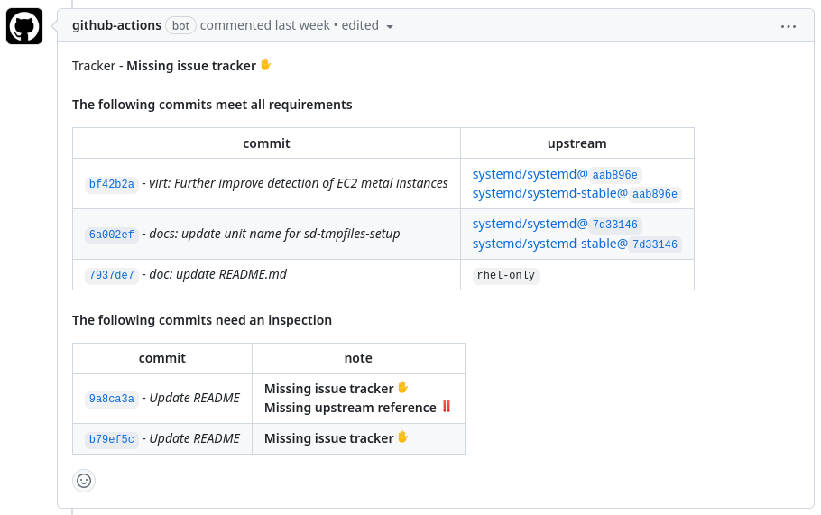

<!-- markdownlint-disable MD033 MD041 -->
<p align="center">
  
  <h1 align="center">Advanced Commit Linter</h1>
</p>

[![GitHub Marketplace][market-status]][market] [![Tests][test-status]][test] [![Lint Code Base][linter-status]][linter] [![CodeQL][codeql-status]][codeql] [![Check dist/][check-dist-status]][check-dist] [![codecov][codecov-status]][codecov]

<!-- Status links -->

[market]: https://github.com/marketplace/actions/advanced-commit-linter
[market-status]: https://img.shields.io/badge/Marketplace-Advanced%20Commit%20Linter-blue.svg?colorA=24292e&colorB=0366d6&style=flat&longCache=true&logo=data:image/png;base64,iVBORw0KGgoAAAANSUhEUgAAAA4AAAAOCAYAAAAfSC3RAAAABHNCSVQICAgIfAhkiAAAAAlwSFlzAAAM6wAADOsB5dZE0gAAABl0RVh0U29mdHdhcmUAd3d3Lmlua3NjYXBlLm9yZ5vuPBoAAAERSURBVCiRhZG/SsMxFEZPfsVJ61jbxaF0cRQRcRJ9hlYn30IHN/+9iquDCOIsblIrOjqKgy5aKoJQj4O3EEtbPwhJbr6Te28CmdSKeqzeqr0YbfVIrTBKakvtOl5dtTkK+v4HfA9PEyBFCY9AGVgCBLaBp1jPAyfAJ/AAdIEG0dNAiyP7+K1qIfMdonZic6+WJoBJvQlvuwDqcXadUuqPA1NKAlexbRTAIMvMOCjTbMwl1LtI/6KWJ5Q6rT6Ht1MA58AX8Apcqqt5r2qhrgAXQC3CZ6i1+KMd9TRu3MvA3aH/fFPnBodb6oe6HM8+lYHrGdRXW8M9bMZtPXUji69lmf5Cmamq7quNLFZXD9Rq7v0Bpc1o/tp0fisAAAAASUVORK5CYII=

[linter]: https://github.com/redhat-plumbers-in-action/advanced-commit-linter/actions/workflows/lint.yml
[linter-status]: https://github.com/redhat-plumbers-in-action/advanced-commit-linter/actions/workflows/lint.yml/badge.svg

[test]: https://github.com/redhat-plumbers-in-action/advanced-commit-linter/actions/workflows/test.yml
[test-status]: https://github.com/redhat-plumbers-in-action/advanced-commit-linter/actions/workflows/test.yml/badge.svg

[codeql]: https://github.com/redhat-plumbers-in-action/advanced-commit-linter/actions/workflows/codeql-analysis.yml
[codeql-status]: https://github.com/redhat-plumbers-in-action/advanced-commit-linter/actions/workflows/codeql-analysis.yml/badge.svg

[check-dist]: https://github.com/redhat-plumbers-in-action/advanced-commit-linter/actions/workflows/check-dist.yml
[check-dist-status]: https://github.com/redhat-plumbers-in-action/advanced-commit-linter/actions/workflows/check-dist.yml/badge.svg

[codecov]: https://codecov.io/gh/redhat-plumbers-in-action/advanced-commit-linter
[codecov-status]: https://codecov.io/gh/redhat-plumbers-in-action/advanced-commit-linter/branch/main/graph/badge.svg?token=YO0RD8EESQ

<!-- -->

Advanced Commit Linter is a GitHub Action that lint commit messages of PR. It checks for issue trackers and upstream references. Results can be displayed as a status check or Pull Request comment when used together with [issue-commentator](https://github.com/redhat-plumbers-in-action/issue-commentator) GitHub Action.

## How does it work

TBA

<picture>
  <source media="(prefers-color-scheme: dark)" srcset="docs/images/linter-comment-dark.png">
  
</picture>

## Features

* Tracker references validator
* Upstream references (cherry-pick) validator

## Usage

To set up Advanced Commit Linter, we need three files:

* Workflow that captures Pull Request metadata (number and commit metadata) and uploads this data as an artifact
* Workflow that runs on `workflow-run` trigger, downloads artifact, and runs `advanced-commit-linter` GitHub Action
* `advanced-commit-linter.yml` configuration

> [!NOTE]
>
> Setup is complicated due to GitHub [permissions on `GITHUB_TOKEN`](https://docs.github.com/en/actions/security-guides/automatic-token-authentication#permissions-for-the-github_token). When used in workflow executed from fork it has `read-only` permissions. By using the `workflow-run` trigger we are able to [safely overcome this limitation](https://securitylab.github.com/research/github-actions-preventing-pwn-requests/) and it allows us to comment on Pull Requests.

```yml
policy:
  cherry-pick:
    upstream:
      - github: systemd/systemd
      - github: systemd/systemd-stable
    exception:
      note:
        - rhel-only
  tracker:
    - keyword:
        - 'Resolves: #'
        - 'Related: #'
      type: bugzilla
      issue-format:
        - '[0-9]+$'
      url: 'https://bugzilla.redhat.com/show_bug.cgi?id='
      exception:
        note:
          - github-only
    - keyword:
        - 'Resolves: '
        - 'Related: '
      type: jira
      issue-format:
        - 'JIRA-1234'
      url: 'https://issues.redhat.com/browse/'
      exception:
        note:
          - github-only
```

```yml
name: Gather Pull Request Metadata
on:
  pull_request:
    types: [ opened, reopened, synchronize ]
    branches: [ main ]

permissions:
  contents: read

jobs:
  gather-metadata:
    runs-on: ubuntu-latest

    steps:
      - name: Repository checkout
        uses: actions/checkout@v3

      - id: Metadata
        name: Gather Pull Request Metadata
        uses: redhat-plumbers-in-action/gather-pull-request-metadata@v1

      - name: Upload artifact with gathered metadata
        uses: actions/upload-artifact@v3
        with:
          name: pr-metadata
          path: ${{ steps.Metadata.outputs.metadata-file }}
```

```yml
name: Commit Linter
on:
  workflow_run:
    workflows: [ Gather Pull Request Metadata ]
    types:
      - completed

permissions:
  contents: read

jobs:
  download-metadata:
    if: >
      github.event.workflow_run.event == 'pull_request' &&
      github.event.workflow_run.conclusion == 'success'
    runs-on: ubuntu-latest

    outputs:
      pr-metadata: ${{ steps.Artifact.outputs.pr-metadata-json }}

    steps:
      - id: Artifact
        name: Download Artifact
        uses: redhat-plumbers-in-action/download-artifact@v1
        with:
          name: pr-metadata

  commit-linter:
    needs: [ download-metadata ]
    runs-on: ubuntu-latest

    outputs:
      validated-pr-metadata: ${{ steps.commit-linter.outputs.validated-pr-metadata }}

    permissions:
      # required for creation of checks
      checks: write

    steps:
      - id: commit-linter
        name: Lint Commits
        uses: redhat-plumbers-in-action/advanced-commit-linter@v1
        with:
          pr-metadata: ${{ needs.download-metadata.outputs.pr-metadata }}
          token: ${{ secrets.GITHUB_TOKEN }}
```

## Configuration options

Action currently accepts the following options:

```yml
# ...

- uses: redhat-plumbers-in-action/advanced-commit-linter@v1
  with:
    pr-metadata:    <pr-metadata.json>
    config-path:    <path to config file>
    set-status:     <true or false>
    status-title:  <h3 title of status message>
    token:          <GitHub token or PAT>

# ...
```

### pr-metadata

Stringified JSON Pull Request metadata provided by GitHub Action [`redhat-plumbers-in-action/gather-pull-request-metadata`](https://github.com/redhat-plumbers-in-action/gather-pull-request-metadata).

Pull Request metadata has the following format: [metadata format](https://github.com/redhat-plumbers-in-action/gather-pull-request-metadata#metadata)

* default value: `undefined`
* requirements: `required`

### config-path

Path to configuration file. Configuration file format is described in: [Policy section](#policy).

* default value: `.github/advanced-commit-linter.yml`
* requirements: `optional`

### set-status

Set status on Pull Request. If enabled, Action will create check-run with validation results.

* default value: `false`
* requirements: `optional`

### status-title

Optional H3 title of status message.

* default value: `Commit validation`
* requirements: `optional`

### token

GitHub token or PAT is used for setting status checks on Pull Request.

```yml
# required permission
permissions:
  checks: write
  pull-requests: write
```

* default value: `undefined`
* requirements: `required`
* recomended value: `secrets.GITHUB_TOKEN`

## Policy

Action is configured using special policy file: `.github/advanced-commit-linter.yml`. The structure needs to be as follows:

```yml
policy:
  cherry-pick:
    upstream:
      - github: systemd/systemd
      - github: systemd/systemd-stable
    exception:
      note:
        - rhel-only
  tracker:
    - keyword:
        - 'Resolves: #'
        - 'Related: #'
      type: bugzilla
      issue-format:
        - '[0-9]+$'
      url: 'https://bugzilla.redhat.com/show_bug.cgi?id='
      exception:
        note:
          - github-only
    - keyword:
        - 'Resolves: '
        - 'Related: '
      type: jira
      issue-format:
        - 'RHELPLAN-\d+$'
      url: 'https://issues.redhat.com/browse/'
      exception:
        note:
          - github-only
```

### `cherry-pick` keyword

The section that specifies upstreams for which you frequently cherry-pick.

* requirements: `optional`

### `cherry-pick.upstream` keyword

An array of upstreams. Currently, the only supported upstream location is GitHub.

Supported keys:

* `github` - GitHub repository in format `<org>/<repo>`
* requirements: `required`

### `cherry-pick.exception` keyword

Property that describes possible exceptions for referencing upstream commits in commit messages. Currently supported exceptions:

* `note` - for example `downstream-only` or `rhel-only`

### `tracker` keyword

The section specifies the form and type of required trackers.

### `tracker[].keyword` keyword

Keyword that prefixes tracker identificator.

* requirements: `required`
* example: `Fixes:`

### `tracker[].type` keyword

Type of tracker. Data can be used by postprocessing scripts/GitHub Actions.

Currently supproted types of trackers are: `bugzilla`, `jira` and `unknown`.

* requirements: `required`

### `tracker[].issue-format` keyword

Regex that describes identificator of given tracker.

* requirements: `required`
* example: `[0-9]+$`

### `tracker[].url` keyword

Url to better display detected trackers in Pull Request comment as a link. Tracker ID will be appended at the end of `url`.

* requirements: `optional`
* example: `https://issues.redhat.com/browse/`

### `tracker[].exception` keyword

Property that describes possible exceptions for referencing trackers in commit messages. Currently supported exceptions:

* `note` - for example `github-only` or `tests-only`

## Outputs

### validated-pr-metadata

<details>
  <summary>Example of validated metadata object</summary>

  ```ts
  const metadata = {
    number: 15,
    labels: [
      {
        id: 5610751380,
        name: 'bug',
        description: 'Bug label',
      },
    ],
    milestone: {},
    commits: [
      {
        sha: 'b145cbd729d33cc50d299079a9a5c643531ad053',
        url: 'https://github.com/redhat-plumbers-in-action/advanced-commit-linter/commit/b145cbd729d33cc50d299079a9a5c643531ad053',
        message: {
          title: 'fix Typo in README.md',
          body: 'fix: typo\
  \
  rhel-only\
  \
  Related: RHELPLAN-1234',
          cherryPick: [],
        },
        validation: {
          status: 'success',
          message:
            '| https://github.com/redhat-plumbers-in-action/advanced-commit-linter/commit/b145cbd729d33cc50d299079a9a5c643531ad053 - _fix: typo_ | `rhel-only` |',
          tracker: {
            status: 'success',
            message:
              '[RHELPLAN-1234](https://issues.redhat.com/browse/RHELPLAN-1234)',
            data: [
              {
                data: {
                  keyword: 'Related: ',
                  id: 'RHELPLAN-1234',
                  type: 'jira',
                  url: 'https://issues.redhat.com/browse/RHELPLAN-1234',
                },
              },
            ],
          },
          upstream: {
            data: [],
            status: 'success',
            exception: 'rhel-only',
          },
        },
      },
    ],
    validation: {
      status: 'success',
      tracker: {
        message: 'Tracker found',
        type: 'unknown',
        id: 'RHELPLAN-1234',
        url: 'https://issues.redhat.com/browse/RHELPLAN-1234',
      },
      message:
        'Tracker - [RHELPLAN-1234](https://issues.redhat.com/browse/RHELPLAN-1234)\
  \
  #### The following commits meet all requirements\
  \
  | commit | upstream |\
  |---|---|\
  | https://github.com/redhat-plumbers-in-action/advanced-commit-linter/commit/b145cbd729d33cc50d299079a9a5c643531ad053 - _fix: typo_ | `rhel-only` |',
    },
  };
  ```

</details>

#### `commits[].validation.status` keyword

Status of commit validation. Can be one of the following values:

* `success` - commit meets all requirements
* `failure` - commit does not meet all requirements

#### `commits[].validation.message` keyword

Message that describes commit validation status.

#### `commits[].validation.tracker` keyword

Object that describes all trackers detected in commit message and their validation status.

```ts
tracker: {
  status: 'success',
  message: '[RHELPLAN-1234](https://issues.redhat.com/browse/RHELPLAN-1234)',
  data: [{
    data: {
      keyword: 'Related: ',
      id: 'RHELPLAN-1234',
      type: 'jira',
      url: 'https://issues.redhat.com/browse/RHELPLAN-1234',
    },
  }],
}
```

#### `commits[].validation.upstream` keyword

Object that describes all upstreams detected in commit message and their validation status.

```ts
upstream: {
  data: [{
    sha: 'b145cbd729d33cc50d299079a9a5c643531ad053',
    repo: 'systemd/systemd',
    url: 'https://github.com/systemd/systemd/commit/b145cbd729d33cc50d299079a9a5c643531ad053',
  }],
  status: 'success',
  exception: 'rhel-only',
}
```

#### `validation` keyword

Object that describes overall validation status of all commits in Pull Request.

```ts
validation: {
  status: 'success',
  tracker: {
    message: 'Tracker found',
    type: 'unknown',
    id: 'RHELPLAN-1234',
    url: 'https://issues.redhat.com/browse/RHELPLAN-1234',
  },
  message:
    'Tracker - [RHELPLAN-1234](https://issues.redhat.com/browse/RHELPLAN-1234)\
\
#### The following commits meet all requirements\
\
| commit | upstream |\
|---|---|\
| https://github.com/redhat-plumbers-in-action/advanced-commit-linter/commit/b145cbd729d33cc50d299079a9a5c643531ad053 - _fix: typo_ | `rhel-only` |',
}
```
